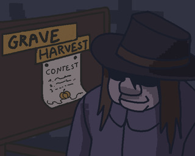

<h1>"Grave Harvest :jack_o_lantern:" - Game Jam</h1>

<h3>Description :page_facing_up:</h3>

Have you ever dreamt of becoming a pumpkin farmer? No? Doesn’t matter, because now you can become one! You’re only two clicks away from fulfilling this dream! Don’t wait, just jump in the mysterious far… graveyard and start growing the biggest pumpkin of all time! The most elite contest for the greatest pumpkin in the universe won’t win itself, will it?

Making the biggest pumpkin but feeding it with fertilizer from task (repairing cross, lighting a candle, planting flowers, cutting grass). But be aware of ghost and the time passing

[Link to the game on Ludum Dare :video_game:](https://ldjam.com/events/ludum-dare/52/grave-harvest)

<h2></h2>
<h3>Controls :keyboard:</h3>

Keyboard:
- `WSDA` - move
- `X` or `Space` - attack ghost / cut grass
- `LMB` - tasks / feeding pumpkin
- `Esc` - pause

Joystick:
- `Left Stick` - move
- `Right Trigger` - attack ghost / cut grass
- `A` - tasks / feeding pumpkin
- `Start` - pause
- `X` - change selection in menu

<h2></h2>
<h3>Trailer :clapper:</h3>

<h2></h2>
<h3>Creators :fire:</h3>

- [r00gal](https://github.com/Alaliszon121)
- [alicjaswiers](https://github.com/alicjaswiers)
- [ArcherWike](https://github.com/ArcherWike)
- [Arvi](https://github.com/Arvi-beep-boop)
- [Daddy](https://github.com/DaddyMilker)
- [Emka5885](https://github.com/Emka5885)
- [Laura](https://github.com/meowmeow420)
- [Nartyna](https://github.com/Nartynka)
- [Nathaneel](https://github.com/NNathaneel)
- [Seviaru](https://github.com/Seviaru)

<h2></h2>
<h3>Results :heart:</h3>

